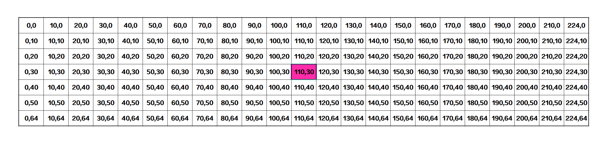
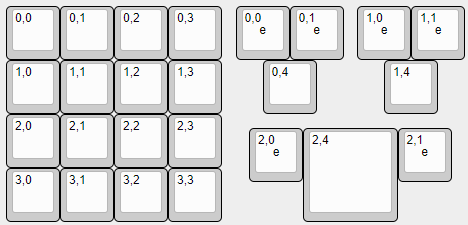

# 硬件设计

a10：[自定义按键小键盘_stm32重制 - 立创开源硬件平台](https://oshwhub.com/ayanami-1/new_pad)

# 编写键盘固件

## 1. 文件格式

### 基本配置文件

1. 各种预处理器指令：[config.h的配置](https://docs.qmk.fm/config_options "config.h的配置")
2. 设置将要编译的 MCU 的某些信息，以及启用和禁用某些功能：[rules.mk的配置](https://docs.qmk.fm/config_options#the-rules-mk-file)
3. 配置键盘硬件和功能集：[keyboard.json的配置](https://docs.qmk.fm/porting_your_keyboard_to_qmk#keyboard-json "keyboard.json的配置")
4. 键盘布局：[keymap.c的配置](https://docs.qmk.fm/keymap#keymap-and-layers)
5. 灯光：[键盘背光矩阵](https://docs.qmk.fm/features/rgb_matrix)；[灯效配置](https://docs.qmk.fm/features/rgb_matrix#rgb-matrix-effects)
   RGB矩阵物理位置索引图
   
6. 指示灯功能：[指示灯配置](https://docs.qmk.fm/features/rgb_matrix#indicators)
7. 编码器：[编码器配置](https://docs.qmk.fm/features/encoders#encoder-map)

### **stm32F103系列芯片**

#### 文件夹格式

```
│  chconf.h
│  config.h
│  halconf.h
│  keyboard.json
│  mcuconf.h
│  redme.txt
│  rules.mk
│
└─keymaps
    ├─default
    │      keymap.c
    │
    ├─via
    │      keymap.c
    │      rules.mk
    │
    └─vial
            config.h
            keymap.c
            rules.mk
            vial.json
```

#### 我的键盘布局

自定义小键盘：[a10键盘layout](https://keyboard-layout-editor.com/##@@=0,0&_x:1&w:2%3B&=0,3%3B&@_y:0.5%3B&=1,0&=1,1&=1,2&=1,3%3B&@=2,0&=2,1%3B&@_y:-0.5&x:2%3B&=0,0%0A%0A%0A%0A%0A%0A%0A%0A%0Ae&=2,2&=0,1%0A%0A%0A%0A%0A%0A%0A%0A%0Ae%3B&@_y:-0.5%3B&=3,0&=3,1)

68键配列键盘：[a11键盘layout](https://keyboard-layout-editor.com/##@@=0,0&=0,1&=0,2&=0,3&=0,4&=0,5&=0,6&=0,7&=0,8&=0,9&=0,10&=0,11&=0,12&_w:2%3B&=0,13&_x:0.25%3B&=0,14&=0,15%3B&@_w:1.5%3B&=1,0&=1,1&=1,2&=1,3&=1,4&=1,5&=1,6&=1,7&=1,8&=1,9&=1,10&=1,11&=1,12&_w:1.5%3B&=1,13&_x:0.25%3B&=1,14&=1,15%3B&@_w:1.75%3B&=2,0&=2,1&=2,2&=2,3&=2,4&=2,5&=2,6&=2,7&=2,8&=2,9&=2,10&=2,11&_w:2.25%3B&=2,13%3B&@_w:2.25%3B&=3,0&=3,1&=3,2&=3,3&=3,4&=3,5&=3,6&=3,7&=3,8&=3,9&=3,10&_w:2.75%3B&=3,13&_x:0.25%3B&=3,14%3B&@_w:1.25%3B&=4,0&_w:1.25%3B&=4,1&_w:1.25%3B&=4,2&_w:6.25%3B&=4,5&_w:1.25%3B&=4,9&_w:1.25%3B&=4,10&_w:1.25%3B&=4,12&_x:0.5%3B&=4,13&=4,14&=4,15)

#### stm32F103系列芯片必须要在根目录下添加的文件包括 `chconf.h`，`halconf.h`，`mcuconf.h`

* **chconf.h**

```c
/*
 * This file was auto-generated by:
 *    `qmk chibios-confmigrate -i keyboards/cannonkeys/ortho48/chconf.h -r platforms/chibios/common/configs/chconf.h`
 */

#pragma once

#define CH_CFG_ST_TIMEDELTA 0

#define CH_CFG_USE_CONDVARS_TIMEOUT FALSE

#include_next <chconf.h>

```

* **halconf.h**

```c
/*
 * This file was auto-generated by:
 *    `qmk chibios-confmigrate -i keyboards/cannonkeys/ortho48/halconf.h -r platforms/chibios/common/configs/halconf.h`
 */

#pragma once

#undef HAL_USE_PWM
#define HAL_USE_PWM TRUE

#include_next <halconf.h>

```

* **mcuconf.h**

```c
/*
 * This file was auto-generated by:
 *    `qmk chibios-confmigrate -i keyboards/cannonkeys/ortho48/mcuconf.h -r platforms/chibios/STM32_F103_STM32DUINO/configs/mcuconf.h`
 */

#pragma once

#include_next <mcuconf.h>

#undef STM32_PWM_USE_TIM1
#define STM32_PWM_USE_TIM1 TRUE

#undef STM32_PWM_USE_ADVANCED
#define STM32_PWM_USE_ADVANCED TRUE

```

## 2. vial.json的编写

一个键盘样式



- 基本框架

  ```json
  {
      "name": "键盘名称",
      "vendorId": "0xXXXX",
      "productId": "0xXXXX",
      "lighting": "vialrgb",
      "matrix": {
          "rows": 4,
          "cols": 5
      },
      "layouts": {
        "keymap": [...]
      }
  }
  ```
- keymap

  [键盘layout编辑器](https://keyboard-layout-editor.com/ "键盘layout编辑器")：编辑键盘布局，rawdata作为keymap的参数

  对于带有编码器的按键，需要遵循[vial官方文档](https://get.vial.today/docs/encoders.html)布局

## 3. keyboard.json的编写

将KLE的源代码直接转换为keyboard.json的工具：[工具](https://qmk.fm/converter/)

踩坑：

- 编码器的配置项一定要放在keyboard.json中，再config.h中配置无效

  ```json
  "encoder":{
      "rotary":[
         {"pin_a":"B3","pin_b":"B4","resolution":2}
       ]
  },
  ```

一个标准模板

```json
{
    "keyboard_name": "xxx",
    "manufacturer": "xxx",
    "url": "xxx",
    "maintainer": "xxx",
    "usb": {
        "vid": "0x0194",
        "pid": "0x0463",
        "device_version": "0.0.1"
    },
    "processor": "STM32F103",
    "bootloader": "stm32duino",
    "diode_direction": "COL2ROW",
    "features": {
        "bootmagic": true,
        "command": false,
        "console": false,
        "extrakey": true,
        "mousekey": true,
        "nkro": true,
        "encoder":true
    },
    "encoder":{
        "rotary":[
            {"pin_a":"B3","pin_b":"B4","resolution":2}
        ]
    },
    "matrix_pins": {
        "cols": ["A6", "A5", "A7", "B15"],
        "rows": ["B14", "B12", "A8", "A4"]
    },
    "layouts": {
        "LAYOUT": {
            "layout": [
                {"label": "0,0", "matrix":[0,0],"x":0,"y":0},
                {"label": "0,3", "matrix":[0,3],"x":2.5,"y":0},
                {"label": "1,0", "matrix":[1,0],"x":0,"y":1.5},
                {"label": "1,1", "matrix":[1,1],"x":1,"y":1.5},
                {"label": "1,2", "matrix":[1,2],"x":2,"y":1.5},
                {"label": "1,3", "matrix":[1,3],"x":3,"y":1.5},
                {"label": "2,0", "matrix":[2,0],"x":0,"y":2.5},
                {"label": "2,1", "matrix":[2,1],"x":1,"y":2.5},
                {"label": "2,2", "matrix":[2,2],"x":2,"y":3},
                {"label": "3,0", "matrix":[3,0],"x":0,"y":3.5},
                {"label": "3,1", "matrix":[3,1],"x":1,"y":3.5}
            ]
        }
    }
}

```
