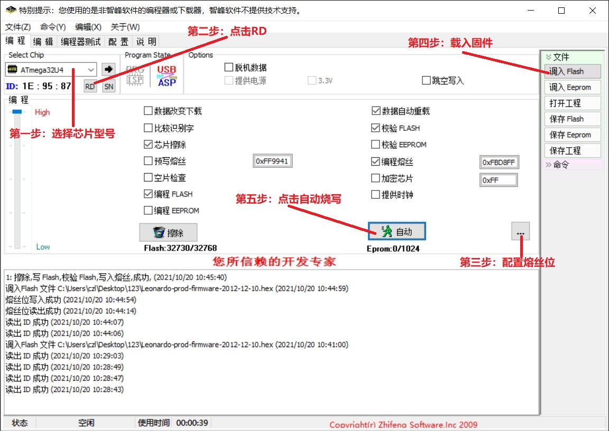

# 针对STM32F103系列芯片：

1. 初次烧录时用stm32 ST-LINK utility擦除芯片，然后烧录stm32duino_bootloader.bin
2. 然后使用QMK MSYS编译源码得到bin或hex文件
3. 用USB线将键盘连接到电脑，使用QMK TOOLBOX选择bin或hex文件烧录到键盘
4. 烧录完固件后无法继续烧录新的固件，需要重复1、2、3步骤烧录新固件

# 针对atmega32u4芯片：

1. 直接将编译生成的bin或hex文件烧录到键盘

选择bootloader然后点击“自动”完成烧录
